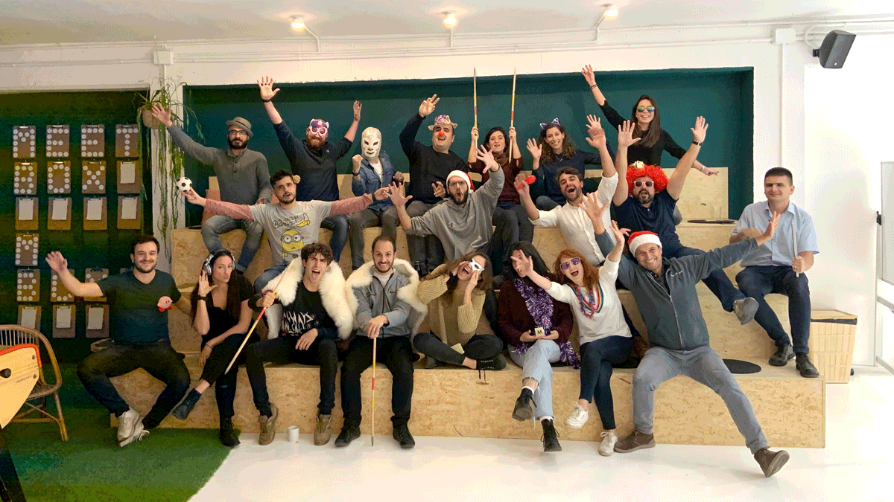
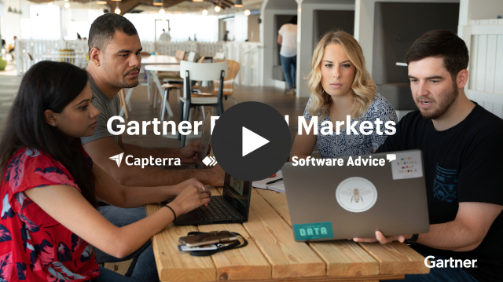

# Join our product & engineering team!

We’re a curious, supportive, and high-performing team of professionals that is passionate about creating a culture where every engineer, designer, product manager, and UX researcher gets to make a real impact.

Businesses around the world use [GetApp](https://getapp.com) every day to make the right technology decisions and find the tools they need to grow, optimize, and become more effective at what they do.

If you have a passion for technology and development, a hunger to learn, and a desire to meet challenges, we'd love to get to know you!

GetApp makes up 1/3 of Gartner Digital Markets, with headquarters located in central Barcelona, Spain. 

## How we work:

*   We have a **flexible start each morning** — you can come in anytime between 7:30 and 10:30. We update the team on our progress during our **daily meeting** which begins at 10:30. If you’re working from home that day, don’t worry, you can easily join us via a high-quality video call. 
*   Twice a week, we **discuss new ideas and topics** that any team member brings to the table, such as, _“We could test using X”_, or _“What about changing this naming convention?”_, or _“This would speed up the deployment process, what do you think?”_. Each proposal opens a new discussion, which eventually leads to changes that **impact and improve our daily work**. All members vote. **Everyone’s opinion matters.**
*   We like to keep the number of meetings down to a minimum in order to maximize our time to stay focused. However, we do have biweekly **SCRUM meetings** for **planning** or **retrospective,** as well as bimonthly meetings with the **product team**.
*   **Pair programming** and **Code reviews** allow us to make sure we are all on the same page and our work meets our quality standards. We have a **pretty sane testing culture** too — which helps us keep things under control.
*   We don’t like to schedule meetings after 5 PM, so, depending on the time you came in, you’ll usually get to head home at around 6:30 PM (or earlier — if you’re an early bird!).
*   On Fridays, we have beers at 1 PM (aka **Beer O’Clock**) with the entire GDM team in Barcelona. From time to time, we’ll have our beers during a **Tech Talk**, if there are any presentations scheduled for that day. We head home around 2 or 3 PM and enjoy an early start to the weekend. 

## Who you’ll work with:

10 software engineers, 2 UX designers, 1 UX writer, 1 product manager, 1 QA, 1 data analyst, 2 creative designers… And more to come!

## 6-month plan:

**Your first week,** you’ll meet the entire team and get your development environment ready to work autonomously. You’ll be able to begin contributing to the team with small developments that will help you get up to speed, as well as become familiar with the GetApp product.

**Your first month,** you’ll already be working on the development of key features on the website. You’ll be taking part in design discussions, you’ll be a real contributor to the team, as well as join all product-related meetings that bring new ideas and make an impact. 

**In 3 months,** you’ll be a full contributor in terms of development and team initiatives. You’ll propose improvements to the way we work based on your previous experience and the knowledge you bring on board. 

**In 6 months,** you’ll get full autonomy to work on projects — from gathering requirements to final product development.

---

At **Gartner Digital Markets**, we go all out when it comes to ensuring your health and happiness. We make it one of our top priorities to give you plenty of reasons to love working here, including a modern approach to work and the best office perks.

## What we offer: 

*   **Limitless growth** and **learning opportunities** — unlimited access to books, videos, and live training with your own [O’Reilly](https://www.oreilly.com/) account, exclusive Gartner research & training, plus opportunities to attend the hottest tech conferences in Europe.  
*   **A collaborative and positive culture** — join a diverse team of creative, friendly and talented professionals that are as smart and driven as you.
*   **A chance to make an impact** — your work will contribute directly to our strategy. 
*   **A modern approach to work** — flexible hours, half-day Fridays, weekly remote work, and more.
*   **In-office perks** — we stock our kitchen with fresh fruit, snacks, a selection of teas, solidarity coffee, and a fridge full of beer for our official Beer O’Clock on Friday afternoons. [🍻](https://emojiterra.com/clinking-beer-mugs/)
*   **Social & team building activities** such as movie night, laser tag, bowling, escape room, summer beach party, hiking & bbq, and more! 
*   **A sunny office close to the beach** in Barcelona’s 22@ district of "innovation and tech" in the Poblenou neighborhood.
*   **Relocation assistance** for those coming from out of town — a specialist to help you with all the appointments and paperwork.

## What you’ll get:

*   Competitive salary
*   23 days annual holiday, and additional days off for your birthday, 24th & 31st of December
*   Private medical and dental care 
*   Life and disability insurance
*   Public transport subsidy
*   Ticket Restaurant card
*   Childcare vouchers (Ticket Guarderia)
*   Pension scheme

## What is Gartner Digital Markets?

Gartner Digital Markets is made up of the 3 leading B2B software search websites — Capterra, GetApp and Software Advice. Together, our mission is to simplify the way software buyers research and discover the right tools for their business.

We offer the fast pace and excitement of working for a startup, the stability and resources of a large, established organization, and the opportunity to be on the front lines of innovation in an industry that is constantly growing and transforming.

Our fast-growing team is made up of a diverse group of professionals in an actively collaborative environment. We encourage people to take initiative, suggest new ideas, inspire and get inspired in a positive, friendly and productive atmosphere. 

 

**GetApp** HQ: Barcelona, Spain

**Capterra** HQ: Arlington, Virginia, USA

**Software Advice** HQ: Austin, Texas, USA

Visit the [GDM homepage](https://www.gartner.com/en/digital-markets), or check us out on [LinkedIn](https://www.linkedin.com/showcase/gartner-digital-markets/)

## About GetApp:

**Founded**: 2010

**Based in:** Barcelona, Spain

**First office:** Sailboat

**Joined the family:** 2015 

GetApp’s target users are software-savvy buyers who understand the importance of technology, and what it means for the future of their business in an ever-changing environment.  

We provide our users with a proprietary recommendation engine that leverages the combination of user insights and deep technical knowledge to recommend the best software choice. 

The website’s newest feature is our native chatbot or ‘virtual assistant’, powered by AI technologies including Google's machine learning and natural language processing (NLP).

Follow us on:

*   [Twitter](https://www.twitter.com/GetApp)
*   [Instagram](https://www.instagram.com/getappcom)
*   [Facebook](https://www.facebook.com/GetAppcom)

